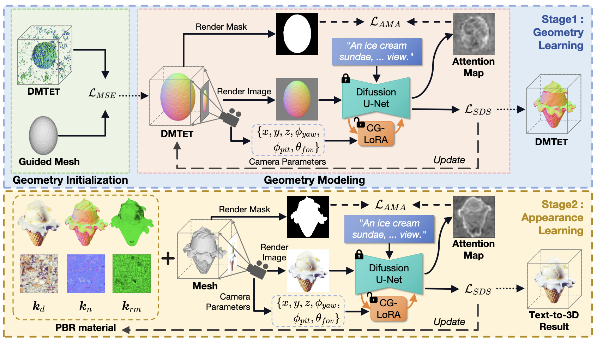

<p align="center">
  
</p>

# X-Dreamer 💤
A pytorch implementation of “X-Dreamer: Creating High-quality 3D Content by Bridging the Domain Gap Between Text-to-2D and Text-to-3D Generation”

[【Paper】](https://arxiv.org/abs/2312.00085)  [【Project Page】](https://xmu-xiaoma666.github.io/Projects/X-Dreamer/)

# Introduction Video 🎥
[](https://private-user-images.githubusercontent.com/33897496/287681032-18f0483f-f870-4c3d-932b-85544dfdf9c0.mp4?jwt=eyJhbGciOiJIUzI1NiIsInR5cCI6IkpXVCJ9.eyJpc3MiOiJnaXRodWIuY29tIiwiYXVkIjoicmF3LmdpdGh1YnVzZXJjb250ZW50LmNvbSIsImtleSI6ImtleTEiLCJleHAiOjE3MDE2ODkxNzAsIm5iZiI6MTcwMTY4ODg3MCwicGF0aCI6Ii8zMzg5NzQ5Ni8yODc2ODEwMzItMThmMDQ4M2YtZjg3MC00YzNkLTkzMmItODU1NDRkZmRmOWMwLm1wND9YLUFtei1BbGdvcml0aG09QVdTNC1ITUFDLVNIQTI1NiZYLUFtei1DcmVkZW50aWFsPUFLSUFJV05KWUFYNENTVkVINTNBJTJGMjAyMzEyMDQlMkZ1cy1lYXN0LTElMkZzMyUyRmF3czRfcmVxdWVzdCZYLUFtei1EYXRlPTIwMjMxMjA0VDExMjExMFomWC1BbXotRXhwaXJlcz0zMDAmWC1BbXotU2lnbmF0dXJlPWMxMjc2Y2QxMGEzZjhjYjc5NDU2YTRkNzZkZDk2MGM2NGQ0YmQ4NTczM2Y0MjVkMTA3OWRiMGQ1ODcwYzhhMjUmWC1BbXotU2lnbmVkSGVhZGVycz1ob3N0JmFjdG9yX2lkPTAma2V5X2lkPTAmcmVwb19pZD0wIn0.jZv9--G5eYx4Rxglc5QkL8Jr4yKV02OlO_pDveNlvNE)

[](https://private-user-images.githubusercontent.com/33897496/285799664-fc389cff-3f8c-4287-a399-1e48b42603cd.MP4?jwt=eyJhbGciOiJIUzI1NiIsInR5cCI6IkpXVCJ9.eyJpc3MiOiJnaXRodWIuY29tIiwiYXVkIjoicmF3LmdpdGh1YnVzZXJjb250ZW50LmNvbSIsImtleSI6ImtleTEiLCJleHAiOjE3MDEwNzc0ODEsIm5iZiI6MTcwMTA3NzE4MSwicGF0aCI6Ii8zMzg5NzQ5Ni8yODU3OTk2NjQtZmMzODljZmYtM2Y4Yy00Mjg3LWEzOTktMWU0OGI0MjYwM2NkLk1QND9YLUFtei1BbGdvcml0aG09QVdTNC1ITUFDLVNIQTI1NiZYLUFtei1DcmVkZW50aWFsPUFLSUFJV05KWUFYNENTVkVINTNBJTJGMjAyMzExMjclMkZ1cy1lYXN0LTElMkZzMyUyRmF3czRfcmVxdWVzdCZYLUFtei1EYXRlPTIwMjMxMTI3VDA5MjYyMVomWC1BbXotRXhwaXJlcz0zMDAmWC1BbXotU2lnbmF0dXJlPTMwMmI0Zjg0YWRiZGY1YmYzOTQ2MWFhZjQwZjZkNDcxN2E1ODEzNjgyYzZjOGNiZWRjZGM5NDUyMTU2OWY3NDMmWC1BbXotU2lnbmVkSGVhZGVycz1ob3N0JmFjdG9yX2lkPTAma2V5X2lkPTAmcmVwb19pZD0wIn0.QHdxR3l_LPe0AgBXeEUmhRVl3osevGnEyYjRYWfYO5M)


# Overview 💻

<p align="center">
  
</p>
<p astyle="text-align: justify;">Overview of the proposed X-Dreamer, which consists of two main stages: geometry learning and appearance learning.For the geometry learning stage, we employ DMTET as the 3D representation and initialize it with a 3D ellipsoid using the mean squared error (MSE) loss. Subsequently, we optimize DMTET and CG-LoRA using the score distillation sampling (SDS) loss and our proposed attention-mask alignment (AMA) loss to ensure the alignment between the 3D representation and the input text prompt. For the appearance learning, we leverage bidirectional reflectance distribution function (BRDF) modeling. Specifically, we utilize an MLP with trainable parameters to predict surface materials. Similar to the geometry learning stage, we optimize the MLP and CG-LoRA using the SDS loss and the AMA loss to achieve alignment between the 3D representation and the input text prompt.
</p>

# News 📝
**Code is comming soon!!!**
- 2023.11.27: Create Repository


# Results 🔍
[](https://private-user-images.githubusercontent.com/33897496/285799510-e40e917d-c202-489a-9e2c-f47409e1c879.mp4?jwt=eyJhbGciOiJIUzI1NiIsInR5cCI6IkpXVCJ9.eyJpc3MiOiJnaXRodWIuY29tIiwiYXVkIjoicmF3LmdpdGh1YnVzZXJjb250ZW50LmNvbSIsImtleSI6ImtleTEiLCJleHAiOjE3MDEwNzc0NDIsIm5iZiI6MTcwMTA3NzE0MiwicGF0aCI6Ii8zMzg5NzQ5Ni8yODU3OTk1MTAtZTQwZTkxN2QtYzIwMi00ODlhLTllMmMtZjQ3NDA5ZTFjODc5Lm1wND9YLUFtei1BbGdvcml0aG09QVdTNC1ITUFDLVNIQTI1NiZYLUFtei1DcmVkZW50aWFsPUFLSUFJV05KWUFYNENTVkVINTNBJTJGMjAyMzExMjclMkZ1cy1lYXN0LTElMkZzMyUyRmF3czRfcmVxdWVzdCZYLUFtei1EYXRlPTIwMjMxMTI3VDA5MjU0MlomWC1BbXotRXhwaXJlcz0zMDAmWC1BbXotU2lnbmF0dXJlPWQ0YTc2MTA2ZTQzNjM4ZjliZjZmYjQzYzVkZDMxOTUwYzQ0NzMzYTZlYmI3MTMwZmFhZDJhZWE1NTIzOGEyODUmWC1BbXotU2lnbmVkSGVhZGVycz1ob3N0JmFjdG9yX2lkPTAma2V5X2lkPTAmcmVwb19pZD0wIn0.T3Xg2-HbWlMeRg5PmEZ7LhUMsc34vFYA6Ij3TYmj2Bg)

## Example generated objects

We conduct the experiments using four Nvidia RTX 3090 GPUs and the PyTorch library. To calculate the SDS loss, we utilize the Stable Diffusion implemented by Hugging Face Diffusers. For the DMT<sub>ET</sub> and material encoder, we implement them as a two-layer MLP and a single-layer MLP, respectively, with a hidden dimension of 32. We optimize X-Dreamer for 2000 iterations for geometry learning and 1000 iterations for appearance learning.

### Text-to-3D generation from an ellipsoid

We present representative results of X-Dreamer for text-to-3D generation, utilizing an ellipsoid as the initial geometry.

| Image | Normal |
| --- | --- |
|  |  |
| *A DSLR photo of a blue and white porcelain vase, highly detailed, 8K, HD.* | *A DSLR photo of a blue and white porcelain vase, highly detailed, 8K, HD.* |
|  |  |
| *A cabbage, highly detailed.* | *A cabbage, highly detailed.* |
|  |  |
| *A chocolate cupcake, highly detailed.* | *A chocolate cupcake, highly detailed.* |
|  |  |
| *A sliced loaf of fresh bread.* | *A sliced loaf of fresh bread.* |
|  |  |
| *A DSLR photo of a pear, highly detailed, 8K, HD.* | *A DSLR photo of a pear, highly detailed, 8K, HD.* |
|  |  |
| *A hamburger.* | *A hamburger.* |
|  |  |
| *A DSLR photo of a corn, highly detailed, 8K, HD.* | *A DSLR photo of a corn, highly detailed, 8K, HD.* |

### Text-to-3D generation from coarse-grained meshes

X-Dreamer also supports text-based mesh geometry editing and is capable of delivering excellent results.

| Coarse-grained Mesh | Image | Normal |
| --- | --- | --- |
|  |  |  |
| | *A beautifully carved wooden queen chess piece.* | *A beautifully carved wooden queen chess piece.* |
|  |  |  |
| | *Barack Obama's head.* | *Barack Obama's head.* |


<div class="columns is-centered has-text-centered">
  <div class="column is-full-width">
    <h2 class="title is-3">Different lighting conditions</h2>
    <div class="content has-text-justified">
      <p>
        We demonstrate how swapping the HDR environment map results in diverse lighting, thereby creating
        various reflective effects on the generated 3D assets in X-Dreamer.
      </p>
    </div>
    <table>
          <tr style="background-color: white;">
            <td align="center">Env. Map1</td>
            <td align="center">Env. Map2</td>
            <td align="center">Env. Map3</td>
            <td align="center">Env. Map4</td>
            <td align="center">Env. Map5</td>
          </tr> 
          <tr style="background-color: white;">
            <td align="center"></td>
            <td align="center"></td>
            <td align="center"></td>
            <td align="center"></td>
            <td align="center"></td>
          </tr>
          <tr style="background-color: white;">
            <td align="center"></td>
            <td align="center"></td>
            <td align="center"></td>
            <td align="center"></td>
            <td align="center"></td>
          </tr>
          <tr style="background-color: white;">
            <td align="center"></td>
            <td align="center"></td>
            <td align="center"></td>
            <td align="center"></td>
            <td align="center"></td>
          </tr>
          <tr style="background-color: white;">
            <td colspan="9" align="center">A DSLR photo of a brown cowboy hat.</td>
          </tr>
           <tr style="background-color: white;">
            <td align="center"></td>
            <td align="center"></td>
            <td align="center"></td>
            <td align="center"></td>
            <td align="center"></td>
          </tr>
          <tr style="background-color: white;">
            <td colspan="9" align="center">Messi's head, highly detailed, 8K, HD.</td>
          </tr>
          <tr style="background-color: white;">
            <td align="center"></td>
            <td align="center"></td>
            <td align="center"></td>
            <td align="center"></td>
            <td align="center"></td>
          </tr>
          <tr style="background-color: white;">
            <td colspan="9" align="center">A DSLR photo of a fox, highly detailed.</td>
          </tr>
          <tr style="background-color: white;">
            <td align="center"></td>
            <td align="center"></td>
            <td align="center"></td>
            <td align="center"></td>
            <td align="center"></td>
          </tr>
          <tr style="background-color: white;">
            <td colspan="9" align="center">A DSLR photo of red rose, highly detailed, 8K, HD.</td>
          </tr>
          <tr style="background-color: white;">
            <td align="center"></td>
            <td align="center"></td>
            <td align="center"></td>
            <td align="center"></td>
            <td align="center"></td>
          </tr>
          <tr style="background-color: white;">
            <td colspan="9" align="center">A marble bust of a mouse.</td>
          </tr>
          <tr style="background-color: white;">
            <td align="center"></td>
            <td align="center"></td>
            <td align="center"></td>
            <td align="center"></td>
            <td align="center"></td>
          </tr>
          <tr style="background-color: white;">
            <td colspan="9" align="center">A small saguaro cactus planted in a clay pot.</td>
          </tr>
          <tr style="background-color: white;">
            <td align="center"></td>
            <td align="center"></td>
            <td align="center"></td>
            <td align="center"></td>
            <td align="center"></td>
          </tr>
          <tr style="background-color: white;">
            <td colspan="9" align="center">A DSLR photo of a vase, highly detailed, 8K, HD.</td>
          </tr>
              </table>
  </div>
</div>


  <div class="columns is-centered has-text-centered">
    <div class="column is-full-width">
      <h2 class="title is-3">Editing process</h2>
      <div class="content has-text-justified">
        <p>
          We demonstrate the editing process of the geometry and appearance of 3D assets in X-Dreamer using an
          ellipsoid and coarse-grained guided meshes as geometric shapes for initialization, respectively.
        </p>
      </div>
      <table>
        <tr style="background-color: white;">
          <td class="title is-5" colspan="2" align="center">From an ellipsoid</td>
          <td class="title is-5" colspan="2" align="center">From coarse-grained guided meshes</td>
        </tr>
        <tr style="background-color: white;">
          <td>
            <video preload="auto" controls>
              <source src="https://media.githubusercontent.com/media/xmu-xiaoma666/xmu-xiaoma666.github.io/master/Projects/X-Dreamer/static/our_gif/vase_geometry1.mp4" type="video/mp4">
            </video>
          </td>
          <td>
            <video preload="auto" controls>
              <source src="https://media.githubusercontent.com/media/xmu-xiaoma666/xmu-xiaoma666.github.io/master/Projects/X-Dreamer/static/our_gif/vase_appearance1.mp4" type="video/mp4">
            </video>
          </td>
          <td>
            <video preload="auto" controls>
              <source src="https://media.githubusercontent.com/media/xmu-xiaoma666/xmu-xiaoma666.github.io/master/Projects/X-Dreamer/static/our_gif/angel_geometry1.mp4" type="video/mp4">
            </video>
          </td>
          <td>
            <video preload="auto" controls>
              <source src="https://media.githubusercontent.com/media/xmu-xiaoma666/xmu-xiaoma666.github.io/master/Projects/X-Dreamer/static/our_gif/angel_appearance1.mp4" type="video/mp4">
            </video>
          </td>
        </tr>
        <tr style="background-color: white;">
          <td colspan="2" align="center">A DSLR photo of a blue and white porcelain vase, highly detailed, 8K, HD.</td>
          <td colspan="2" align="center">A marble bust of an angel, 3D model, high resolution.</td>
        </tr>
        <tr style="background-color: white;">
          <td>
            <video preload="auto" controls>
              <source src="https://media.githubusercontent.com/media/xmu-xiaoma666/xmu-xiaoma666.github.io/master/Projects/X-Dreamer/static/our_gif/pancakes_geometry1.mp4" type="video/mp4">
            </video>
          </td>
          <td>
            <video preload="auto" controls>
              <source src="https://media.githubusercontent.com/media/xmu-xiaoma666/xmu-xiaoma666.github.io/master/Projects/X-Dreamer/static/our_gif/pancakes_appearance1.mp4" type="video/mp4">
            </video>
          </td>
          <td>
            <video preload="auto" controls>
              <source src="https://media.githubusercontent.com/media/xmu-xiaoma666/xmu-xiaoma666.github.io/master/Projects/X-Dreamer/static/our_gif/army_geometry1.mp4" type="video/mp4">
            </video>
          </td>
          <td>
            <video preload="auto" controls>
              <source src="https://media.githubusercontent.com/media/xmu-xiaoma666/xmu-xiaoma666.github.io/master/Projects/X-Dreamer/static/our_gif/army_appearance1.mp4" type="video/mp4">
            </video>
          </td>
        </tr>
        <tr style="background-color: white;">
          <td colspan="2" align="center">A stack of pancakes covered in maple syrup.</td>
          <td colspan="2" align="center">A DSLR photo of the Terracotta Army, 3D model, high resolution.</td>
        </tr>
      </table>
      </div>
    </div>


  <div class="columns is-centered has-text-centered">
    <div class="column is-full-width">
      <h2 class="title is-3">Comparison</h2>
      <div class="content has-text-justified">
        <p>
          We compared X-Dreamer with four state-of-the-art (SOTA) methods: DreamFusion, Magic3D, Fantasia3D, and
          ProlificDreamer. The results are shown below:
        </p>
      </div>
      <table  style="width: 100%; border-collapse: collapse; background-color: white;">
        <tr style="background-color: white;">
          <td align="center">DreamFusion</td>
          <td align="center">Magic3D</td>
          <td align="center">Fantasia3D</td>
          <td align="center">ProlificDreamer</td>
          <td align="center">X-Dreamer</td>
        </tr>
        <tr style="background-color: white;">
          <td align="center"; style="width: 20%; height: 20%; background-color: white;"></td>
          <td align="center"; style="width: 20%; height: 20%; background-color: white;"></td>
          <td align="center"; style="width: 20%; height: 20%; background-color: white;"></td>
          <td align="center"; style="width: 20%; height: 20%; background-color: white;"></td>
          <td align="center"; style="width: 20%; height: 20%; background-color: white;"></td>
        </tr>
        <tr style="background-color: white;">
          <td align="center"; style="width: 20%; height: 20%; background-color: white;"></td>
          <td align="center"; style="width: 20%; height: 20%; background-color: white;"></td>
          <td align="center"; style="width: 20%; height: 20%; background-color: white;"></td>
          <td align="center"; style="width: 20%; height: 20%; background-color: white;"></td>
          <td align="center"; style="width: 20%; height: 20%; background-color: white;"></td>
        </tr>
        <tr style="background-color: white;">
          <td colspan="5" align="center">A 3D rendering of Batman, highly detailed.</td>
        </tr>
        <tr style="background-color: white;">
          <td align="center"; style="width: 20%; height: 20%; background-color: white;"></td>
          <td align="center"; style="width: 20%; height: 20%; background-color: white;"></td>
          <td align="center"; style="width: 20%; height: 20%; background-color: white;"></td>
          <td align="center"; style="width: 20%; height: 20%; background-color: white;"></td>
          <td align="center"; style="width: 20%; height: 20%; background-color: white;"></td>
        </tr>
        <tr style="background-color: white;">
          <td align="center"; style="width: 20%; height: 20%; background-color: white;"></td>
          <td align="center"; style="width: 20%; height: 20%; background-color: white;"></td>
          <td align="center"; style="width: 20%; height: 20%; background-color: white;"></td>
          <td align="center"; style="width: 20%; height: 20%; background-color: white;"></td>
          <td align="center"; style="width: 20%; height: 20%; background-color: white;"></td>
        </tr>
        <tr style="background-color: white;">
          <td colspan="5" align="center">A cat, highly detailed.</td>
        </tr>
        <tr style="background-color: white;">
          <td align="center"; style="width: 20%; height: 20%; background-color: white;"></td>
          <td align="center"; style="width: 20%; height: 20%; background-color: white;"></td>
          <td align="center"; style="width: 20%; height: 20%; background-color: white;"></td>
          <td align="center"; style="width: 20%; height: 20%; background-color: white;"></td>
          <td align="center"; style="width: 20%; height: 20%; background-color: white;"></td>
        </tr>
        <tr style="background-color: white;">
          <td align="center"; style="width: 20%; height: 20%; background-color: white;"></td>
          <td align="center"; style="width: 20%; height: 20%; background-color: white;"></td>
          <td align="center"; style="width: 20%; height: 20%; background-color: white;"></td>
          <td align="center"; style="width: 20%; height: 20%; background-color: white;"></td>
          <td align="center"; style="width: 20%; height: 20%; background-color: white;"></td>
        </tr>
        <tr style="background-color: white;">
          <td colspan="5" align="center">Garlic with white skin, highly detailed, 8K, HD.</td>
        </tr>
        <tr style="background-color: white;">
          <td align="center"; style="width: 20%; height: 20%; background-color: white;"></td>
          <td align="center"; style="width: 20%; height: 20%; background-color: white;"></td>
          <td align="center"; style="width: 20%; height: 20%; background-color: white;"></td>
          <td align="center"; style="width: 20%; height: 20%; background-color: white;"></td>
          <td align="center"; style="width: 20%; height: 20%; background-color: white;"></td>
        </tr>
        <tr style="background-color: white;">
          <td align="center"; style="width: 20%; height: 20%; background-color: white;"></td>
          <td align="center"; style="width: 20%; height: 20%; background-color: white;"></td>
          <td align="center"; style="width: 20%; height: 20%; background-color: white;"></td>
          <td align="center"; style="width: 20%; height: 20%; background-color: white;"></td>
          <td align="center"; style="width: 20%; height: 20%; background-color: white;"></td>
        </tr>
        <tr style="background-color: white;">
          <td colspan="5" align="center">A statue of Leonardo DiCaprio's head.</td>
        </tr>
        <tr style="background-color: white;">
          <td align="center"; style="width: 20%; height: 20%; background-color: white;"></td>
          <td align="center"; style="width: 20%; height: 20%; background-color: white;"></td>
          <td align="center"; style="width: 20%; height: 20%; background-color: white;"></td>
          <td align="center"; style="width: 20%; height: 20%; background-color: white;"></td>
          <td align="center"; style="width: 20%; height: 20%; background-color: white;"></td>
        </tr>
        <tr style="background-color: white;">
          <td align="center"; style="width: 20%; height: 20%; background-color: white;"></td>
          <td align="center"; style="width: 20%; height: 20%; background-color: white;"></td>
          <td align="center"; style="width: 20%; height: 20%; background-color: white;"></td>
          <td align="center"; style="width: 20%; height: 20%; background-color: white;"></td>
          <td align="center"; style="width: 20%; height: 20%; background-color: white;"></td>
        </tr>
        <tr style="background-color: white;">
          <td colspan="5" align="center">A DSLR photo of Lord Voldemort's head, highly detailed.</td>
        </tr>
      </table>
    </div>
  </div>
 
# Using results in 3D computer graphics software 🔧
[](https://private-user-images.githubusercontent.com/33897496/287680655-08712c2a-1360-42fc-9a0c-1ab13d2a899b.mp4?jwt=eyJhbGciOiJIUzI1NiIsInR5cCI6IkpXVCJ9.eyJpc3MiOiJnaXRodWIuY29tIiwiYXVkIjoicmF3LmdpdGh1YnVzZXJjb250ZW50LmNvbSIsImtleSI6ImtleTEiLCJleHAiOjE3MDE2ODkwNTAsIm5iZiI6MTcwMTY4ODc1MCwicGF0aCI6Ii8zMzg5NzQ5Ni8yODc2ODA2NTUtMDg3MTJjMmEtMTM2MC00MmZjLTlhMGMtMWFiMTNkMmE4OTliLm1wND9YLUFtei1BbGdvcml0aG09QVdTNC1ITUFDLVNIQTI1NiZYLUFtei1DcmVkZW50aWFsPUFLSUFJV05KWUFYNENTVkVINTNBJTJGMjAyMzEyMDQlMkZ1cy1lYXN0LTElMkZzMyUyRmF3czRfcmVxdWVzdCZYLUFtei1EYXRlPTIwMjMxMjA0VDExMTkxMFomWC1BbXotRXhwaXJlcz0zMDAmWC1BbXotU2lnbmF0dXJlPTBkNDE4MWIzOGZmMzFmZDA1MjVlZjMzYTdkZjdiMzA2YzAyZDA1NGMyM2QyY2NlZGJhM2MxODM1YjJiYjM2MDgmWC1BbXotU2lnbmVkSGVhZGVycz1ob3N0JmFjdG9yX2lkPTAma2V5X2lkPTAmcmVwb19pZD0wIn0.M_5j9bUv-5vGuaV59HPCoiFJgN7PhoOSNeByiI0iYEo)


# BibTeX 📚
```
  @article{ma2023xdreamer,
    title={X-Dreamer: Creating High-quality 3D Content by Bridging the Domain Gap Between Text-to-2D and Text-to-3D Generation},
    author={Ma, Yiwei and Fan, Yijun and Ji, Jiayi and Wang, Haowei and Sun, Xiaoshuai and Jiang, Guannan and Shu, Annan and Ji, Rongrong},
    journal={arXiv preprint arXiv:2312.00085},
    year={2023}
  }
```